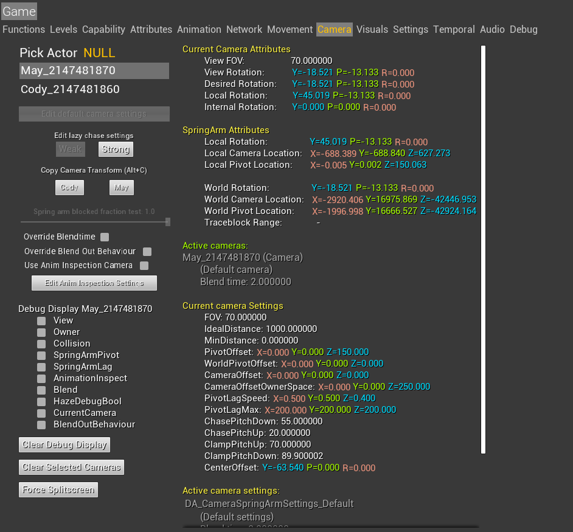
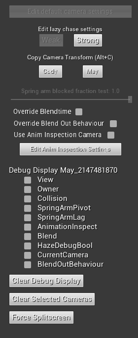

# Camera

## Actor list and various info

<Table>

:::caution
Some settings here doesn't seem to do anything. Double check and see if theres any way to enable these.
:::

</Table>

## Current Camera Attributes

## SpringArm Attributes

## Active Cameras

## Current Camera Settings

## Active Camera Settings

## Active Points of Interest

## Active Camera Shakes

## Active Camera Animations