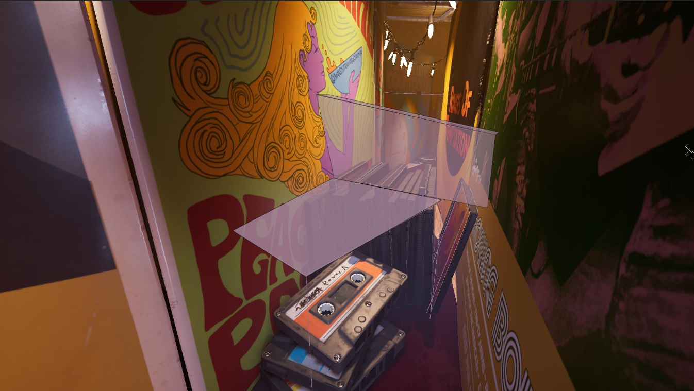

import {YouTube} from 'mdx-embed';

# A Grand Finale

:::caution
- The out of bounds areas within this subchapter are very dark and easy to get lost.
- Practicing this section may cause hand pains due to spamming the dash and jump inputs.
:::
# How it works
- May is able to input a dash after skipping the intro cutscenes to this subchapter as the game spawns her slightly over the floor.
- If May's dash animation finishes or does not input a dash as she lands, she will be put into the intended slow walk animation, so dashing and jumping or frog jumping will be the only way to move around this level.

:::tip
Restarting this method only works on Chapter Select, if you mess up and decide to Restart Checkpoint, you won't be able to replicate the dashes at the start.
:::

<Table>
<May>
After skipping the intro cutscenes May should be spamming dash while the game fades in to gameplay, going through the initial doorframe into the vinyl hall to the first interaction area.

Since it's not intended to jump around freely in this area we found that there are invisible bounds to jump onto that will help us skip through the rooms. This is where the route will branch out to a couple different strats.

 

:::easy
You can rush to interact with to the next section, interacting with the discs allowing Cody to take over.

:::

:::medium
You can jump over the vinyl wall towards the cardboard boxes on the left side to wall jumping while holding backwards to jump around the metal pipes that are in the way behind Cody.

:::

:::hard
Perfect dash slightly forward by dashing against the close left vinyl wall where it will inch you forward enough to jump straight across to the right vinyl wall, lining up to the cardboard boxes outside of the barriers, going under the catwalk and jumping over another disc set which is in line with the final stretch room.

:::
</May>
<Cody>
:::note
The ending will have a weird camera angle for the final kiss interaction, just a visual thing.

:::
:::easy
As the cutscene starts after May interacts with the discs, Cody should be mashing frog jumps until they gain control. It is very easy to lose control during the transition cutscene so mashing at a high APM will make the success rate higher.

:::
</Cody>
</Table>

<Either>
:::easy
After passing through the Catwalk you will see a bundle of cables following a beam tunnel into the final room that would be where May walks past the orchestra into the curtain cutscene.
Cut a corner by jumping over the vinyl wall over the drumset, sending you straight towards the curtain cutscene interact.

:::
</Either>

## GG
The only things left to do after interacting with the curtains, skip the cutscene and hold interact to kiss. That has been the It Takes Two speedrun, congratulations!
